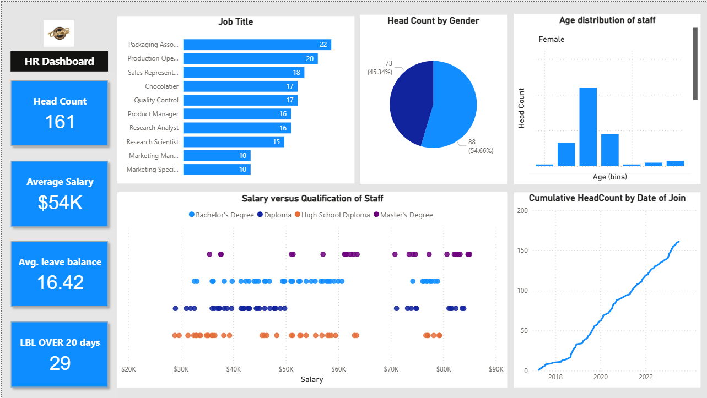

# 👥 HR Analytics Dashboard | Power BI

## 📌 Project Overview
A comprehensive **HR Analytics Dashboard** for visualizing workforce demographics, gender diversity, salary distribution, and headcount trends — enabling HR teams to make data-driven workforce decisions.

---

## 🎯 Business Problem
HR teams needed an automated Power BI dashboard to replace manual Excel reports and monitor key employee metrics such as gender ratio, compensation distribution, and headcount growth.

---

## ⚙️ Tools & Technologies
- Power BI Desktop  
- Power Query & DAX for calculations  
- CSV dataset (~200 rows) from public HR data sources  

---

## 📊 Dashboard Features
- Headcount overview with total employees & average salary  
- Gender diversity visualization  
- Job role and qualification analysis  
- Salary vs education comparison  
- Workforce growth over time  

---

## 🧠 Key Insights
- **161 total employees**, gender ratio ≈ **55% male / 45% female**  
- **Master’s degree holders** earn higher salaries on average  
- **Packaging Associate** role has highest headcount  

---

## 🚀 Impact
- Replaced manual HR reporting with automated dashboards  
- Improved workforce visibility and diversity insights  
- Streamlined salary & workforce analysis for HR planning  

## 📸 Dashboard Preview

## 📁 Dataset
- Source: Public HR dataset (Internet)  
- Format: CSV (~200 rows)

---

## 👩‍💻 Role & Contributions
Independently developed complete dashboard using Power BI — data modeling, DAX measures, and report visualization.

---

## 🧰 How to Use
1. Download **`HR_Data_Analytics.pbix`**  
2. Open in **Power BI Desktop**  
3. Explore visuals and interact with job role, gender, and qualification filters
