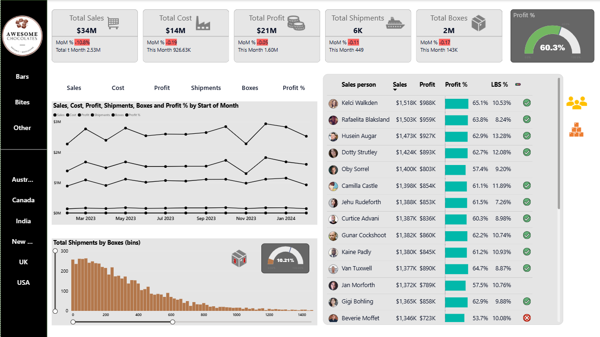

# 🛒 Sales Analysis Dashboard | Power BI

## 📌 Project Overview
An interactive **Sales Performance Dashboard** designed to monitor KPIs such as sales, profit, cost, and shipments. It provides actionable insights for sales strategy, regional performance, and profitability optimization.

---

## 🎯 Business Problem
The organization needed a single dashboard to track sales trends, salesperson performance, and regional profitability without manual Excel reporting.

---

## ⚙️ Tools & Technologies
- Power BI Desktop  
- Power Query for ETL  
- DAX for calculated measures (Profit %, Margin %)  
- CSV dataset (~10K records) from Kaggle  

---

## 📊 Dashboard Features
- Monthly trend analysis for sales, cost, and profit  
- Leaderboard of sales representatives by margin  
- Product-wise and region-wise performance  
- Shipment and utilization analysis  

---

## 🧠 Key Insights
- **Australia** achieved the highest profit percentage.  
- **Chocolate Bars** yielded the top margins.  
- **Marney Obren** ranked as top performer.  

---

## 🚀 Impact
- Reduced manual reporting by **40%**  
- Improved visibility of regional performance  
- Enabled data-driven sales strategy planning  

## 📸 Dashboard Preview

## 📁 Dataset
- Source: [Kaggle Sales Dataset](https://www.kaggle.com/)  
- Format: CSV (~10K records)

---

## 👩‍💻 Role & Contributions
Developed and designed the dashboard end-to-end — data cleaning, modeling, DAX measures, and visualization design.

---

## 🧰 How to Use
1. Download the **`sales.pbix`** file  
2. Open in **Power BI Desktop**  
3. Use filters for region and product to explore insights

## 📁 Files Included

- `SalesDashboard.pbix`: Power BI file

